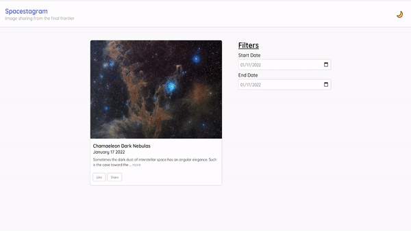

# Spacestagram 👨‍🚀📷

Traverse the universe with [NASA's Astronomy Picture of the Day API](https://github.com/nasa/apod-api). Created for the Shopify Front-End Developer Internship.

View the deployed version [here](https://spacestagram-jt.netlify.com).

## The Challenge

Create a webpge that can pull images, and allow the user to "like" and "unlike" their favourite images.

### Technical Requirements
- Search results should come from NASA's APIs
- Each image result should list at least a title, date of capture and a button to "like"/"unlike"
- The HTML that gets served client-side should be accessible and semantic

### Extra Features
- Light/Dark mode
- Likes are saved in local storage
- Loading state while waiting for NASA's API response
- Start date and end date picker to browse photos from a specific set of days
- Shareable links

## Technology Used
- React.js
- Typescript
- Styled-Components
- Framer Motion
- React Router
- Axios
- Dayjs
- NASA's APOD API
- Local Storage
